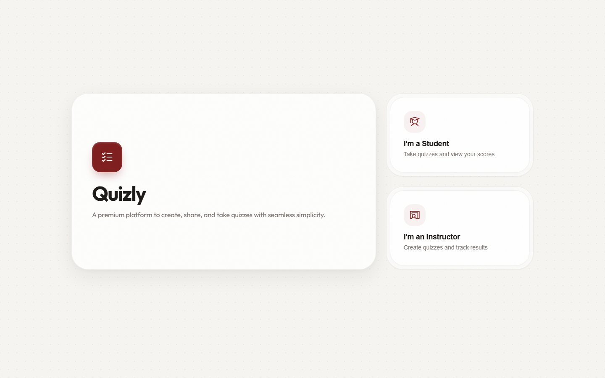

# Quizly

<p align="center">
  <strong>Build quizzes, take them, and review scores in the browser.</strong><br>
  State persists with <code>localStorage</code>. Vanilla HTML, CSS, and JavaScript.
</p>

<p align="center">
  <a href="https://cikeyz.github.io/quizly/">Live Demo</a>
  &nbsp;·&nbsp;
  <a href="#quick-start">Quick Start</a>
  &nbsp;·&nbsp;
  <a href="#project-structure">Structure</a>
  &nbsp;·&nbsp;
  <a href="#license">License</a>
</p>

<p align="center">
  
  
  
  
  
  
</p>

## Contents

- [Overview](#overview)
- [Features](#features)
- [Screenshots](#screenshots)
- [Quick Start](#quick-start)
- [Project Structure](#project-structure)
- [Other Design Eras](#other-design-eras)
- [License](#license)
- [Course Note](#course-note)

## Overview

Quizly is a single-page quiz platform for instructors and students. Instructors build question sets; students take quizzes and see scores. All data stays in the browser via `localStorage` so the demo runs without a server backend.

## Features

| Feature | Description |
|---------|-------------|
| Roles | Instructor and student flows in one SPA |
| Question builder | Dynamic questions and choices |
| localStorage | Quizzes and results stay on the device |
| Scoring | Immediate results after submit |

## Screenshots

| Landing |
|---------|
|  |

## Quick Start

```bash
git clone https://github.com/cikeyz/quizly.git
cd quizly
python -m http.server 8000
# http://localhost:8000
```

## Project Structure

```text
quizly/
├── index.html
├── script.js
├── style.css
├── LICENSE
├── README.md
└── docs/
    └── screenshots/
        └── landing.png
```

## Other Design Eras

| Branch | Description |
|--------|-------------|
| `overhaul/quiz-maker-v1` | Early Quiz Maker UI |
| `overhaul/warm-editorial` | Warm editorial refresh |
| `overhaul/quizly-zinc` | Zinc / cool rebrand |

## License

MIT. See [LICENSE](LICENSE).

## Course Note

Built for CMPE 364 (Web and Mobile Systems), Polytechnic University of the Philippines, under Engr. Arlene B. Canlas. Published here as a standalone project.
